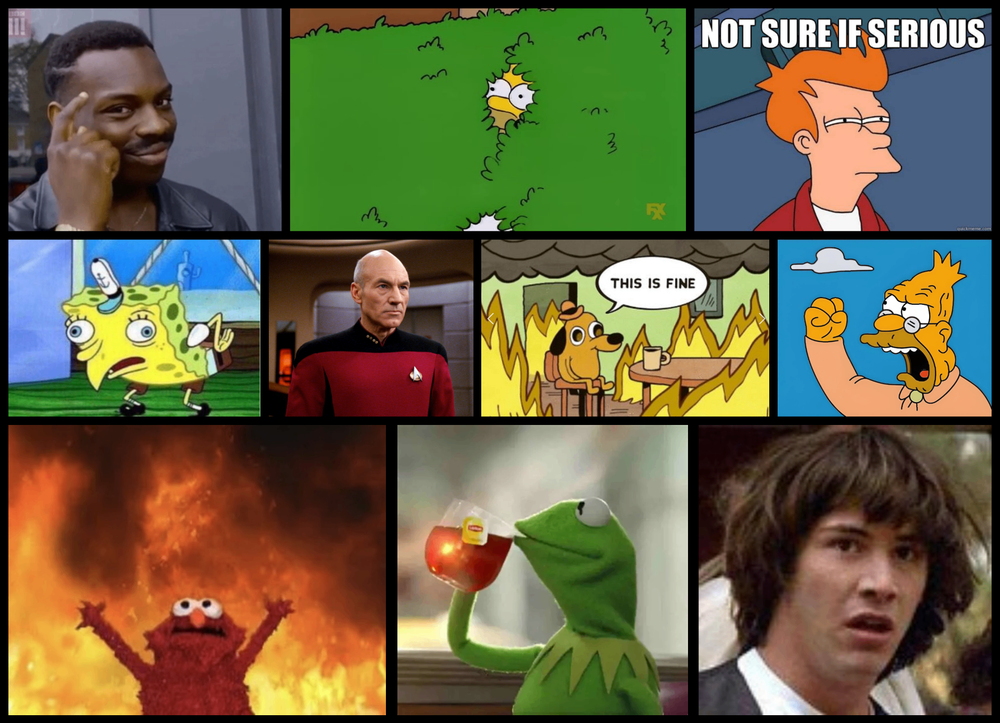

# GridWiggle

Auto-layout photo collage maker. Upload photos, photos with people in them are auto-cropped, pick a photo or two to feature, and get a beautifully laid out grid collage — no manual arranging needed.



## Features

- **Auto-layout** — constraint-based packing produces balanced, beautiful grids automatically
- **Hero photos** — mark one or two photos as heroes for visual prominence
- **AI smart crop** — detects people/faces and crops to keep them visible; skips cropping for non-person photos
  - Desktop: on-device DETR model via Web Worker (Hugging Face Transformers.js)
  - Mobile: server-side Gemini Flash vision (edge function) to avoid Safari ONNX crashes
- **Shuffle** — regenerate layouts instantly for variety
- **Export** — download high-resolution PNG collages

## Tech Stack

- React + TypeScript + Vite
- Tailwind CSS + shadcn/ui
- Web Worker for non-blocking layout generation
- On-device vision model (Hugging Face Transformers.js) + server-side Gemini Flash fallback

## How It Works

The layout engine uses constraint intersection and sub-rectangle decomposition to pack photos into a grid. Hero photos get area-based prominence (not just width). The algorithm evaluates multiple canvas partitioning strategies and scores them on area uniformity, shape compliance, and hero prominence — then picks the best one.

**Algorithm flow:**

1. **Hero separation** — identify hero photo(s) by weight; move the rest into a content pool.
2. **Template selection** — pick candidate templates from a registry (corner-anchor, hero-column, hero-row, band variants, diagonal-corners for dual heroes), filtered by hero aspect ratio and canvas shape compatibility.
3. **Geometry sampling** — for each template, sample combinations of *canvas aspect ratio* and *hero area fraction* (how much of the total canvas area the hero occupies, typically 15–40%).
4. **Region decomposition** — compute the hero rectangle from those parameters, then decompose the remaining canvas into packable regions (e.g., corner-anchor produces a "beside" region and a "below" region).
5. **Row-packing** — pack content photos into each region by deriving a target row count from photo count and mean aspect ratio, then filling rows so total height (or width) matches the region constraint.
6. **Scoring** — evaluate each candidate on cell-area uniformity (F-ratio across size tiers), canvas AR deviation from target, hero prominence (hero area vs. top content areas), and hero coverage ceiling.
7. **Selection** — pick the best candidate deterministically, or weighted-random among top scorers in shuffle mode.
8. **Mirroring** — reflect the layout to a random corner for visual variety.

Layout generation runs in a Web Worker so the UI stays responsive.

## Development

```sh
npm i
npm run dev
```

Dev-only pages are available at `/layout-test`, `/layout-rating`, and `/hero-fraction` for algorithm tuning.

## License

MIT
